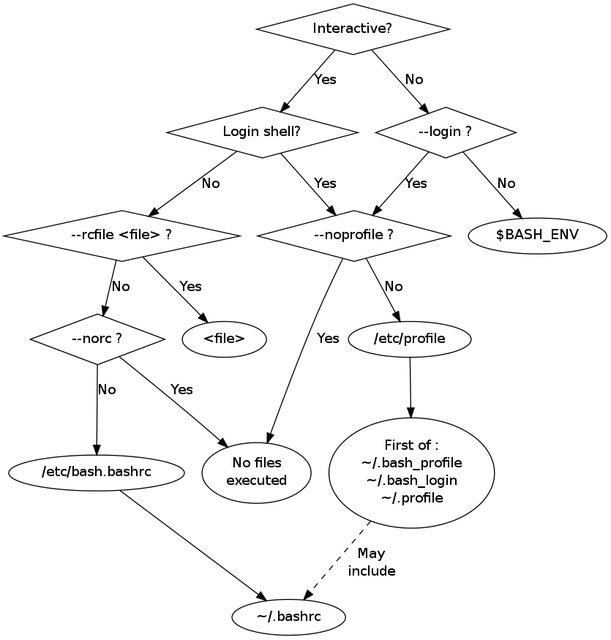

# Bash Startup Files

[Bash](rlstd_bourne-again-shell-bash-for-short.md) has fairly complex logic about which startup files are loaded and when, based on the [type of shell](i5k65_interactive-and-login-shells.md).

interactive login shell:

* /etc/profile
* ~/.bash_profile, ~/.bash_login, and ~/.profile (in that order). It executes the commands from the _first_ readable file found from the list. Each individual user can have their own set of these files.

interactive non-login shell:

* /etc/bash.bashrc: global Bash configuration
* ~/.bashrc: local Bash configuration

